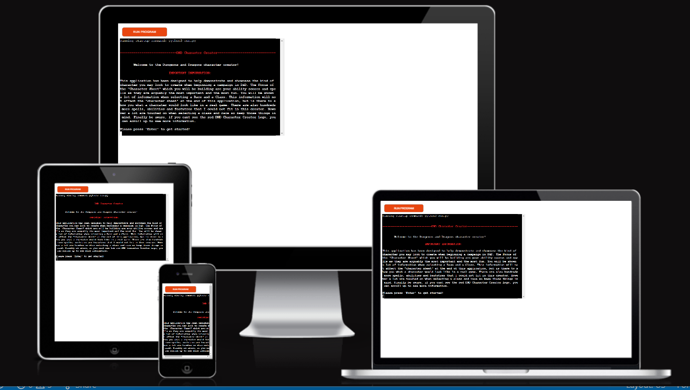
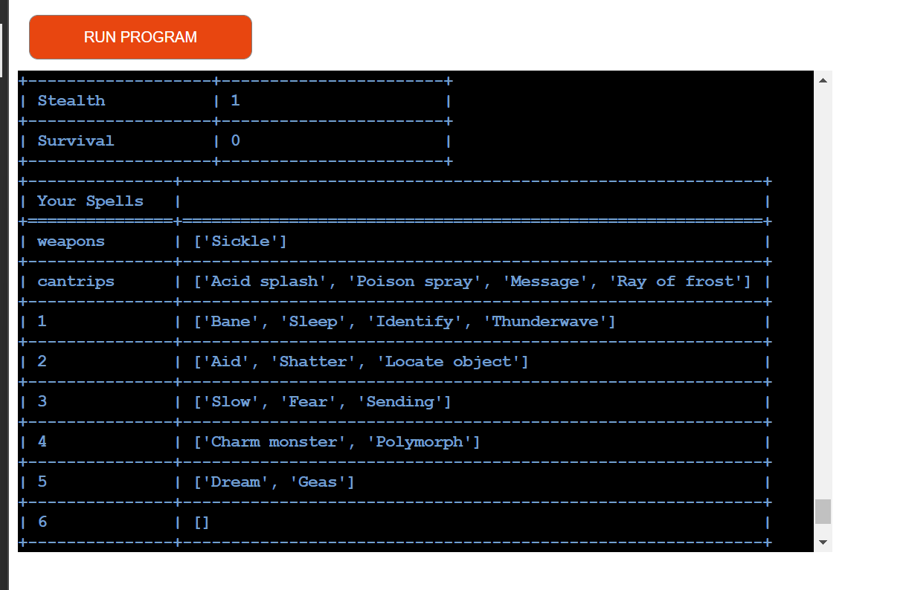

# DND Character Creator

This site has been designed to be a full character creator for DND 5e. However due to time constraints this initail plan has had to be cut down. This site is now here to provide people an insight into what kind of characters are possible within the world of DND. THis site provides a lot of information on different Races, Classes and spells. Although many mechanics of the game are only touched upon and not everything makes it into the character sheet presented at the end, the user should end their time here with atleast an understanding of what the different Races and Classes offer, an insight into what a character at any level may look like and what abilities they may have at each level. This is a site that could be infinitly expanded upon. As you'll see below I have an extensive roadmap of new features and mechanics that can be implemented in the future. It is a shame I could not complete the whole character creator at this time. But this certainly should help potential players get a bitof prior knowledge and hopefully help them in tehir decision of what character they will play, should they go on to join a campaign. 

Find a link to the deployed site [here](https://character-creator-ci-project-3.herokuapp.com/)

## contents:
1. [User experience](#user-experience)
   - [Mockup desings](#simple-initial-design-plans)
2. [Final product](#final-product)
   - 
3. [Features](#features)
   - 
4. [Technology that was utilized](#technology-that-was-utilized)   
   - [Languages](#languages)
   - [External assets](#external-assets-utilized)
5. [Testing](#testing)  
   - [Manual testing](#manual-testing)
   - [Device testing](#device-testing)
6. [Deployment](#deployment)
7. [Credits/Acknowledgments](#creditsacknowledgments)
   - [Content](#content)
   - [Media](#media)  
8. [Final thoughts](#final-thoughts)    
___
## User experience:
### What I wanted to achieve:

1. Create a fun application that allows someone to be able to freely design and build a character that could be used in DnD 5e.

2. Have the user leave the application with a better understanding of what options are available when designing a character.

3. Present the user with a large varity of options that have real effects on the character which allows for hundreds of potentail character options

4. Allow the user the ability to look at all information surronding a choice before confimring that choice.

5. Present the user a charcater sheet at the end of teh application that clearly shows all the choices they made.

___
### The Plan and the Roadmap:
state | Mockup example |

-

___
## Final Product

___
## Features: 
### Welcome page:
  - The first thing the user will see is the intro page. This was put in to help describe the purpose of the site and to help them understand the mechanics. It also helps the user understand that not all the information they read about a race or a class will be present at the end.
  
### Choose Race:
  - The user is then presented with their first choice. What race to play? Here they can select any of the options provided and look through the information about their chosen race. It is hoped here that the user will start to see the depth and posibilities of charcter creation within DnD. They can spend as much time as they like here looking through all the options and confirming their choice when they are ready.
  
  
### Information cycle:
  - The way information is presented is in text blocks, some of which can get quite large. Hence why the intro tells the user that if they can not see the Logo they should scroll up as more information is hidden above. However I wanted to keep information as un cluttered as possible. Hence the ability to cycle through the information. This feature is prominent when choosing a race, a class and when looking at spells. It allows the terminal to be cleared and the next text block to be presented in a clear space so that it is more easily digestable.
  
  
  
### Confirm:
  - At the end of a lot of sections the user will be asked to confirm their choice. This boils down to typing "yes" or "No" but it gives the user pause to think before they proceed. Instead of being forced into the next section they have time to consider and maybe change their mind if they desire to.
  
  
### Choose Class:
  - The second choice the user is presented with is what class they would like to pick. this functions exactly like the race selection. They can cycle through all the information at their liesure and make what ever choice they desire at the end.
  
### Choose Level:
  - The third choice is the level of their charcater. This is an important one as it effects the spells they can select and their hit points. What i hope the user can do from here is see what a high level character may look like. often in character creation people are solely worried about level 1 - 5. here someone could see what their character may look like at level 20.
  
  
  
  
### Your character so far:
  - This is where your hit points are rolled and it is a place to pause and see how the charcater is starting to look. The user can see all their choices so far and reflect on potentially a name for the charcter that they will get to choose later. 
  
### Choose Abilities:
  - This is where the user will assign their ability scores. They can assign any number to any ability. Hopefully from redaing about their class they know roughly what skills to optimise, but they are feee to make any choice they like. they also have the abiility to reassign any f the scores they have set.
  
  
  
  
### Choose Proficencies:
  - The next choice the user will have is to choose two skills to make proficient. Now in the real game some classes and races have pre set proficiencies this isnt something i had time to implement nut may do in the future. For now the user gets the choice of a set of class specific skills to make their charcter proficent in.
  
  
### Choose cantrips and spells:
  - This next choice is not for every class. only spell casters get the opportunity to choose spells. Cantrips are a certain type of spell they dont use spell slots. The cantrip list is also different for every class, The Paladin is the only class that has access to spells but not cantrips. The spell lists are leveled and different levels have access to higher tiers of spells. There is also no difference in what levelled spells are available to different classes. Furthermore different leveled characters can choose more cantrips and spells. This section and the next work just like the class and race options. the user can loook over every spell before making any decisions.
  
  
### Choose Equipment:
  - Next the user can choose what weapons they would like. Some of the classes get 2 weapons some get 1. There are also 2 lists and each class can only pick from 1 list.
  
### Choose Name:
  - Finally the user can choose a name for their character. I purposly put this at the end as I thought it was a nice way to cap off the creation of a character.
  
### Character sheet:
  - And then at the end the user is presented with the 'Character Sheet' This summerises all their choices. Shows their Name, Race, Class, Level, Hit points, Weapons, Spells, Ability scores. skills modifiers and saving throws. 
  
  
  
  
### Colour scheme:
  - Throughout this application the user would of seen various colours. These were specific choices. The Logo is a bright red that so often is related to DnD. Each class and race has their own colour to give a sense of difference but also to give a sense of their 'personality' e.g the elf and gnome are green to reflect their link to Nature. The Tiefling is Red to give a sense of their link to Hell. The Character sheet at the end is also presnted in the colour of the users chosen class.

___
## Technology that was utilized:
### languages:
* python
### external assets utilized:
* [GitHub](https://github.com/)
* [GitPod](https://gitpod.io/)
* [Heroku](https://dashboard.heroku.com/)
___
## testing:
 
### Testing:
#### Feature Testing:
* Fixes refers to any potential current fixes/improvements that are still potentially available. 'None required' refers to the fact that at this moment there is no additional work needed to improve that feature. Many bugs and errors were encounted during the development process and several of these features were very much trail and error. The accounts of which can be found throughout the commits in GitHub.
* Choose Race: 
   - What was expected? The user types a Race from the list provided and is presented with the relevent information regarding that Race. The user can then read and cycle through the information at their liesure. If the user inputs a Race that is not present or spells one of the races incorrectly they are told that their choice is not playable and are asked to pick again.
   - How it was tested? First H was typed, "H is not a playable Race, please select again" was shown. Secondly Humman was typed, "Humman is not a playable Race, please select again." was shown. human was then typed, the first bit of infomation regarding humans was then presented to the user. with the next input "Click enter to cycle through info: " The text colour was also changed to reflect the chosen Race. Enter was clicked. the previos infomation was cleared and the next bit of information was presented. A was then typed into the input. nothing happened. A was then entered. The next bit of information was then presented without issue. These steps were then repeated for all the playable races.
   - What was the outcome? All information presented was correct for that Race, the ability to cycle through the information worked just as planned and only the relevent information is shown. Incorrect inputs are correctly identified and the usre is prompt to choose again.
   - Fixes? None required.
* Choose Class: 
   - What was expected? The user types a class from the list provided and is presented with the relevent information regarding that Class. The user can then read and cycle through the information at their liesure. If the user inputs a Class that is not present or spells one of the Class incorrectly they are told that their choice is not playable and are asked to pick again.
   - How it was tested?  First B was typed, "B is not a playable Class, please select again" was shown. Secondly Bardbarian was typed, "Bardbarian is not a playable Class, please select again." was shown. Barbarian was then typed, the first bit of infomation regarding barbarians was then presented to the user. with the next input "Click enter to cycle through info: " The text colour was also changed to reflect the chosen Class. Enter was clicked. the previos infomation was cleared and the next bit of information was presented. A was then typed into the input. nothing happened. A was then entered. The next bit of information was then presented without issue. These steps were then repeated for all the playable Classes.
   - What was the outcome? All information presented was correct for that Class, the ability to cycle through the information worked just as planned and only the relevent information is shown. Incorrect inputs are correctly identified and the usre is prompt to choose again.
   - Fixes? None required.
* Choose Level: 
   - What was expected? The user chooses a level between 1 and 20. they are then asked to confirm this level. if the user inputs either a string, or a number not within 1 and 20 they are informed that the level chosen is not within the parameters and are asked to pick again.
   - How it was tested? First 0 was inputted. "0 is not a valid character level please select again" was shown to the user. 30 was then inputted. "30 exceeds the maximum level, please pick again" was shown. 'level 1' was then inputted. "please only choose a number between 1 and 20" was shown. finally 1 was inputted. the application was re run to input 10 and 20.
   - What was the outcome? The user can only select a level between 1 and 20 anything else is invalid and can not be submitted.
   - Fixes? None required.
* Rolled hit points: 
   - What was expected? Once the user has chosen a level, their hit points would be rolled and calculated. This should be decided by the class hit dice. e.g Barbarians get a d12 and wizards get a d6. and their level. e.g a level 3 wizard would roll 3 d6. the sum of these dice decide theor hit points. This would then be presented to the user.
   - How it was tested? 3 classes were tested. Rogue, Wizard and Barbarian. The Rogue was made at level 20. The Barabrian and level 1 and the Wizard at level 10. After each level was selected the user is taken to a page that shows the hit dice which is class specfic. A d8 for Rogues, a d6 for Wizards and a d12 for Barbarians. in Each test the correct dice was shown in this page. Under this the user is shown a set of numbers the count of which is equal to the level they selected. This is then summed and added to the 'Hit points' in the Your_Character dictionary. At the bottom of this page the user is shown thir charcater so far.
   - What was the outcome? The correct dice were used for all classes and the amount of dice rolled is correct for each level.
   - Fixes? None required.   
* Choose Abilities: 
   - What was expected? The user is presnted with 3d6 rolls, the sum of which can be assigned to any one of 6 abilities. After assigning the first number a new roll is presented, this is reapeated untill all skills are assigned a score. If the user wishes to assign a rolled score to an already assigned ability they must re assign the old sore, they are not presented a new roll.
   - How it was tested? When creating the Rogue for example the first roll was 16. [6, 4, 6] were the rolls. I went to add this to Dexterity but I typed 'Dex' "please choose only one of the above abilities" was shown and I had to choose again to assign the 16. I then added it to Dexterity. I was asked if I wanted to confirm. I said 'yess' "Please only type 'yes' or 'no'." was shown. I therefore retyped 'Yes'.
   A new role was then provided [5, 1, 4] the sum of which is 10. I put that in constitution. For both these previous 2 rolls the user can see them added into the dictionary above. the third roll was 13. I decided to place this again into constitution. after confirming I was asked to re assign the 10 that was previously in constitution. This was then put into strength. 3 more rolls were provided and put into the remaining abilities.
   - What was the outcome? The ability to assign the numbers works as planned, the user can re assign any that they wish to. any misspelt abilities are noted and the user is asked to try again.
   - Fixes? None required.
* Modifiers and skill calculations: 
   - What was expected? When a score is assigned to an ability all skills that use that ability as thier base are given their modifiers based on what was rolled. e.g the skill Arcana is an intellegnce based skill, if the rolled score assigned to Intellegence is 14 then the Arcana modifier will be +2. likewise stealth is a dexterity based skill. if the score assigned to dexterity is 9 then the modifier to stealth would be -1.
   - How it was tested? The final page shows the user all their modifiers for their skills and abilities. the potentail modifiers were calculated by hand and then checked agaisnt the numbers provided at the final page.
   - What was the outcome? The calculations work. and are all assigned to the correct skill and modifier.
   - Fixes? None required.
* Choose Proficienies: 
   - What was expected? The user is presented with a list of skills two of which can be assigned as proficent skills. The list provided is deterined by the class. e.g a bard can choose any two skills as proficient. However a Barbarian could not Choose Arcana as a proficent skill. there fore it would not appear in the list.
   - How it was tested? The list providied was checked against the list in the google sheets doc to ensure the correct list was being presented. In regards to the Rogue Acrobbatics was inputted first. "Please only choose one of the above skills" was shown. Acrobatics was then put in and I was allowed to choose another skill. for this I put Steal. I was then taken to a page that asked  I double check my spelling. I could see I spealt Stealth wrong so here I typed 'No' to go back and re enter my choices spelt correctly.
   - What was the outcome? The user is presented with the correct list on all counts, the user is also prompted correctly to check their spelling before moving on.
   - Fixes? None required.
* Choose Cantrips: 
   - What was expected? The user would be presented with a list of cantrip spells, the contents of the list would be dependent on the class chosen. the user is allowed to choose a certain number of cantrips depending on their level. When a spell is typed the user is presented with the spells effects and a description and are asked to confirm if they want this spell. If the user mistypes or selects a spell that is not present they are asked to select again. If the chosen class is a martial based character then this choice would be bypassed. 
   - How it was tested? Firstly the martial based characters were selected to make sure they skipped this step. Next the spell casters were chosen the spell list that was presented was chcked against the google sheet doc to make sure the right spells were shown. Next all spells were selected to make sure the relevent information was shown. finally the amount of spells available to be selected was tested by running through charcaters of various levels. To test that only the spells in the list could be selected when testing the wizard the first time slecting a spell aciddd slpash was typed this was met with 'Acidd slpash is not a cantrip, please select again.'
   - What was the outcome? All Martial characters skipped this step. The relevent Classes were shown their relevent lists. all the spells showed the relevent informtion and the correct amount of spells are availbale at each level.
   - Fixes? None required.
* Choose Spells: 
   - What was expected?  The user would be presented with a list of spells, the contents of the list would be dependent on the level chosen. All spell casting classes can choose a certain number of level 1 spells. however as the level increases so does the spells they can choose. e.g a level 3 bard gets 4 evel 1 spells and 2 level 2 spells. however a level 6 bard gets access to 4 level 1 spells, 3 level 2 spells and 3 level 3 spells. The user first picks their level 1 spells, if they have a sufficient level they will then be presented the level 2 spell lista nd so on until their max spell count is met. When a spell is typed the user is presented with the spells effects and a description and are asked to confirm if they want this spell. If the user mistypes or selects a spell that is not present they are asked to select again. If the chosen class is a martial based character then this choice would be bypassed. 
   - How it was tested? Firstly the martial based characters were selected to make sure they skipped this step. Spells were selected from the spell list shown. first bane was chosen. this then took me to the spell description and i was able to confirm my choice or pick again. i confirmed this choice and was able to choose another spell. this time ityped "currre woounds". this was prompted with "currre woounds is not a spell. please select again." All spells were checked to make sure the correct information was shown. like wise at higher levels you can pick more spells and higherlevel spells therefore charcaters were created at different levels to ensure the correct number of spells were available to be chosen as well as the correct caliber of spell.
   - What was the outcome?  All Martial characters skipped this step. All the spells showed the relevent informtion and the correct amount of spells are availbale at each level. And the spell list changed if the level was applicable to higher level spells and all spells were chosen at the prevoius level.
   - Fixes? None required.
* Choose Equipment: 
   - What was expected? The user would be presented with a list of equipment, the contents of the list would be dependent on the class chosen. Classes either get the choice of martial weapons or simple weapons. Some classes also get the choice to pick 2 weapons instead of just one. If the user inputted a weapons that is not in the list they are asked to choose again.
   - How it was tested? The list providied was checked against the weapon list relevent to each class. Some different classes also have access to a different amount of weapons for example the Rogue gets 2 simple weapons where as a wizard only gets 1. Therefore when creating a wizard the page moved on after choosing only 1. where as when making the rogue after the first choice I was able to choose again. Like with the proficiencies when making the rogue I typed dag and then Dagger. This then asked me to double check my spelling, I saw i spelt Dagger wrong so typed 'no' to go back and correct it. Here I typed dggger this was met with "Please only choose from the weapons above." I then typed Dagger for both said yes to confirm and the two weapons were added to the list.
   - What was the outcome? The user is presented with the correct list on all counts, the user is also prompted correctly tyo check their spelling before moving on.
   - Fixes? None required.
* Choose Name: 
   - What was expected? The user is finally presented with the option to choose a name for their charcater. There is no limitation here the user is free to input anything they desire.
   - How it was tested? vax, was typed into the input for the Rogue. grog was typed for the barabrian. In both instances the name was added to the Name key in the correct dictionary.
   - What was the outcome? The user has the ability to na,e theor character what ever they desire and it is added to the relevent dictionary.
   - Fixes? None required.   
* All choice confirmations: 
   - What was expected? At the end of all choices the user is presented with the option to confirm their choice. they can either type yes or no, any other input should be met with 'Please only type yes or no' if the user confimrs their choice then it is added to the relevent dictionary that will form the charcter sheet later. if they choose no then they are given the option to choose again.
   - How it was tested? A the end of cycling through the race and class information the user is presented with an option to confirm or choose again. Likewise at each abiliity score assignment you are asked to confirm. in all these instances first nooo was typed. I was prompt with "please only type 'yes' or 'no'" i would then type no. and I was able to select again. finally I would confirm my choice with 'yes'. This would advance the page when confirming a race and class. In Regards to the abilities confiming would generate a new role. or require a re assignment of an old score.
   - What was the outcome? the user has the ability to confirm their decisions. on all counts the expected behavior is achived when typing 'yes', 'no' or mispelling.
   - Fixes? None required.   
* Present Sheet: 
   - What was expected? At the end of the application the user is presnted with the tabulated data that they entered or has been calculated with their entry. This is in effect their character sheet like you would produce for a real game. it shows their Race, Class, Level, Hit points, Their characters name, Their skills, modifiers and ability scores. their proficient skills. Spells if applicabale and their equipment.
   - How it was tested? At the end of the applicatiuon when all choices had been made the user is presented with a group of tables showing their charcater, the colour of which is linked to the class they chose. This table was read through to ensure all calculations were done correctly, all choices appeared in the correct table and the correct data was submitted to the tables.
   - What was the outcome? The sheet at the end contains all the users information and correct calculations all placed neatly into tables.
   - Fixes? None required.                   
#### Device testing:
This site has been physically tested on:
   - ASUS ZenBook

   ___
## deployment:
  
___
## credits/acknowledgments
### Content:
-
### Media:
-

## Final thoughts
